# Unity Quick Search

Search anything in Unity.

## Search Providers

Using the shortcut ```Alt + ' ``` or the `Help -> Quick Search` menu will bring out the Quick Search Tool. This extensible tool allows you to search over multiple area of Unity.

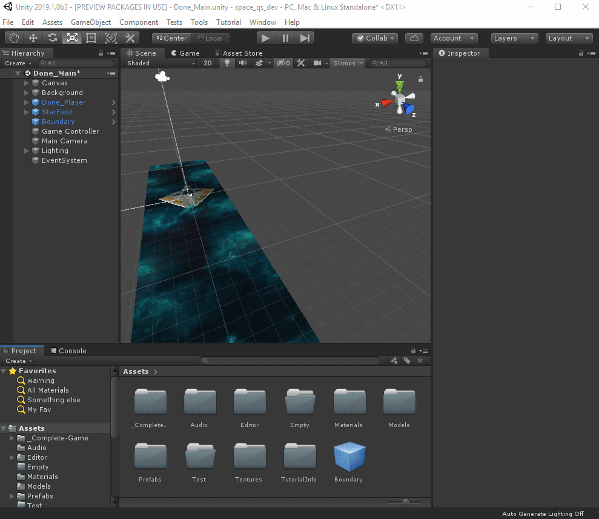

It is easy to add new search providers to the Quick Search Tool (see API section below), by default we ship with these `SearchProviders`:

### Assets

All assets in the current project are available for search. From an asset you can apply the following actions:

- Select the asset (in the Project browser)
- Open the asset (using an external editor if necessary)
- Show in Explorer (Finder)

Asset provider supports advance type filtering (Similar to Project Hierarchy):

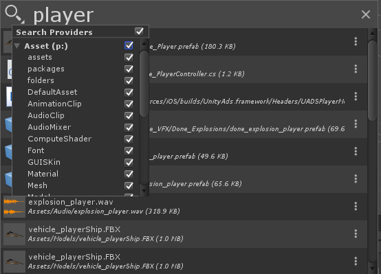

### Current Scene

All GameObjects in the current scene are available for search. Activating a scene item in the Quick Search tool will select the corresponding GameObject in the Scene.

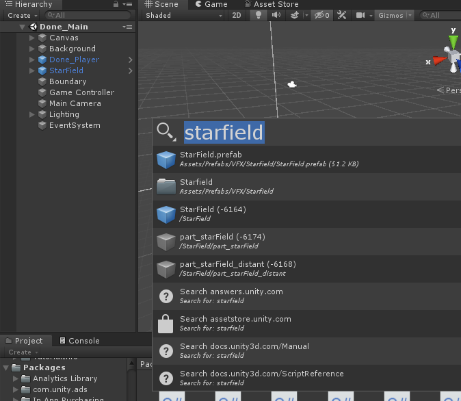

### Menu

Each menu items in Unity is available for search. You can execute the menu item from the Quick Search Tool. This is especially useful to pop that elusive Test Runner or the Profiler!

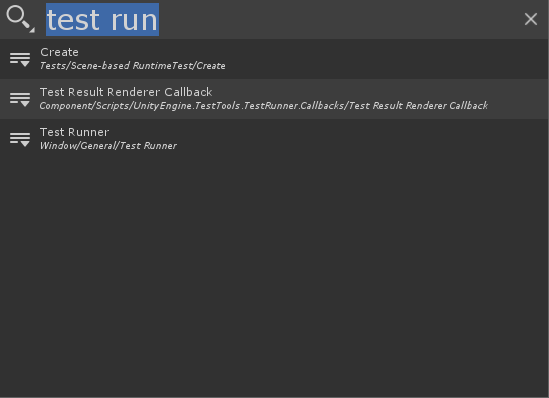

### Settings

Each Project Settings or Preferences pages is available for search. The Quick Search Tool will open the Unified Settings Window at the required pages.

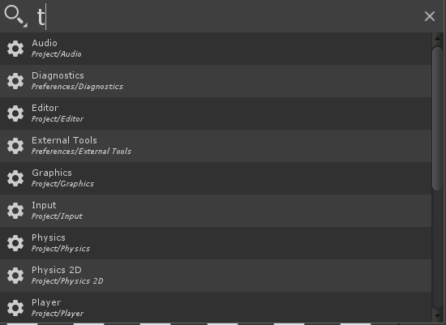

### Online Search Providers

We have a `SearchProvider` that allows to search various Unity websites. Using this provider will open your default browser at a specific Unity page and perform a search and display some results. You can search the following websites and it is very easy to add new web search providers:

- [answers.unity.com](answers.unity.com)
- [The Official Unity Documentation](docs.unity3d.com/Manual)
- [Scripting Reference](docs.unity3d.com/ScriptingReference)
- [The Mighty Unity Asset Store](assetstore.unity.com)

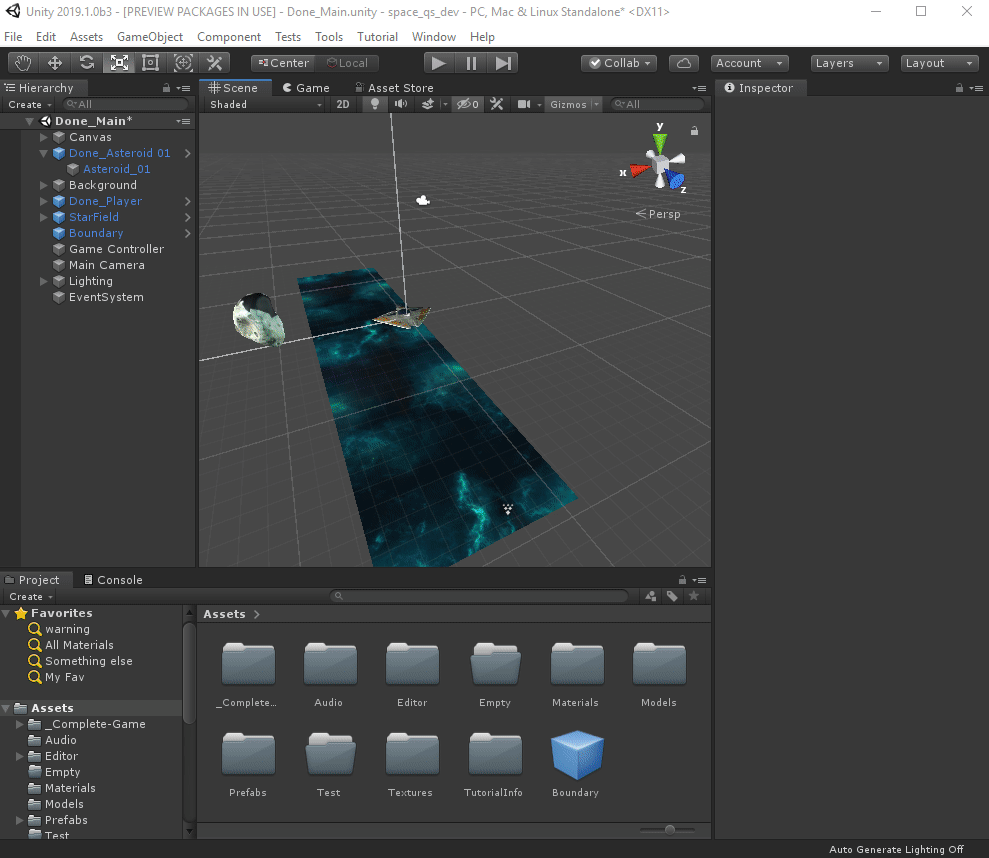

## Keyboard Navigation

All the features of the Quick Search tool can be access using the keyboard:

- The Search box is always focused and you can type even with an element selected.
- `Alt + Left Arrow` : Toggle the Filter view
    - Using `Up Arrow`, `Down Arrow` in the Filter view cycle between filters.
    - Using `spacebar` toggle a filter


- `Alt + Right Arrow` brings the action menu


- `Alt + Up Arrow` or `Alt + Down Arrow` navigate through the search history:


## Filters

There are 2 levels of filtering available in the Quick Search Tool:

### Provider filters
Those filters define which providers are available for a search. This can help reduce the amount of items return by a search query especially if you know what type of item you are looking for.

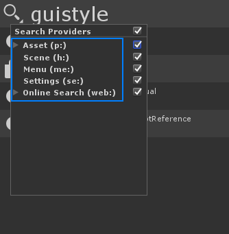

Note that there are more specialized shortcuts to call the Quick Search Tool with a specific provider filter enabled:

- `Alt + Shit + A` : Assets **only** search
- `Alt + Shit + M` : Menu **only** search
- `Alt + Shit + S` : Scene **only** search

### Provider text filters
From the Quick Search Box you can type a search `provider search filter token` that will restrain the search to specific providers. The search tokens are:

- Asset: `p:`
- Menu: `me:`
- Scene: `h:`
- Online Search: `web:`

Example of queries using text providers:

- `p:Player` : Search assets containing "Player"
- `h:Main Camera` : Search scene for GameObjects with "Main Camera" in their name
- `me:Test Runner` : Search menus item for Test Runner
- `se:VFX` : Search settings (project and preferences) for VFX

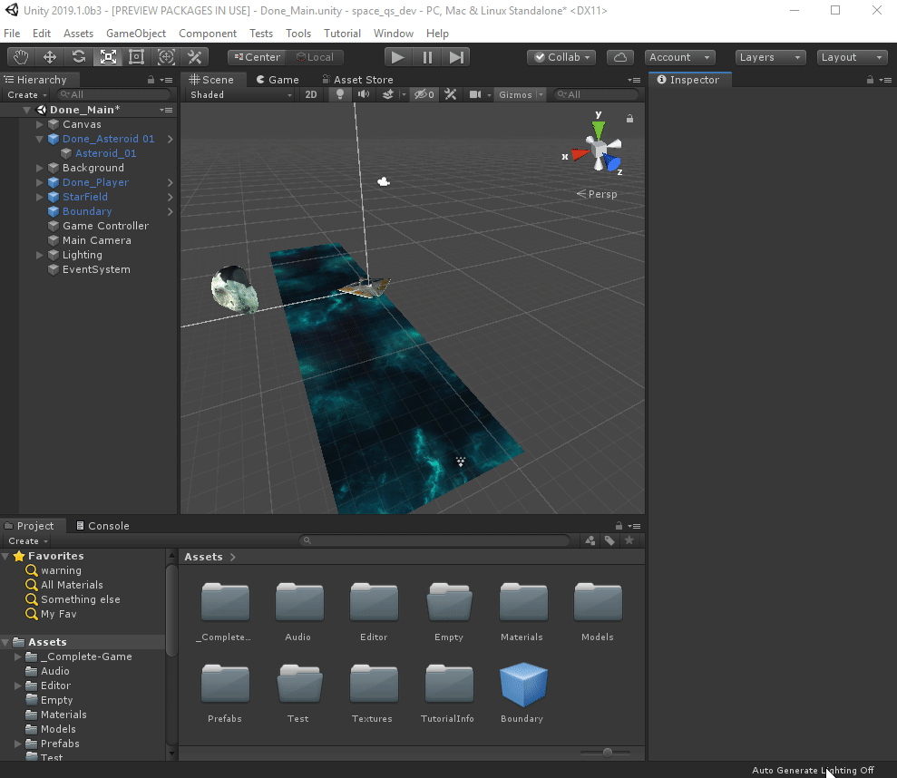

### Provider specific filters
Some provider (i.e the Asset provider) supports specific filters:

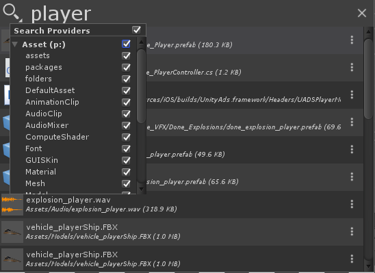

As usual you can pass the same search tokens used by the project browser to a search query:

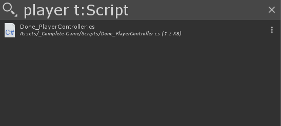

## Last Search

When opening the Quick Search Tool using ```Alt + ` ``` the state (and filters) of your previous search is preserved:

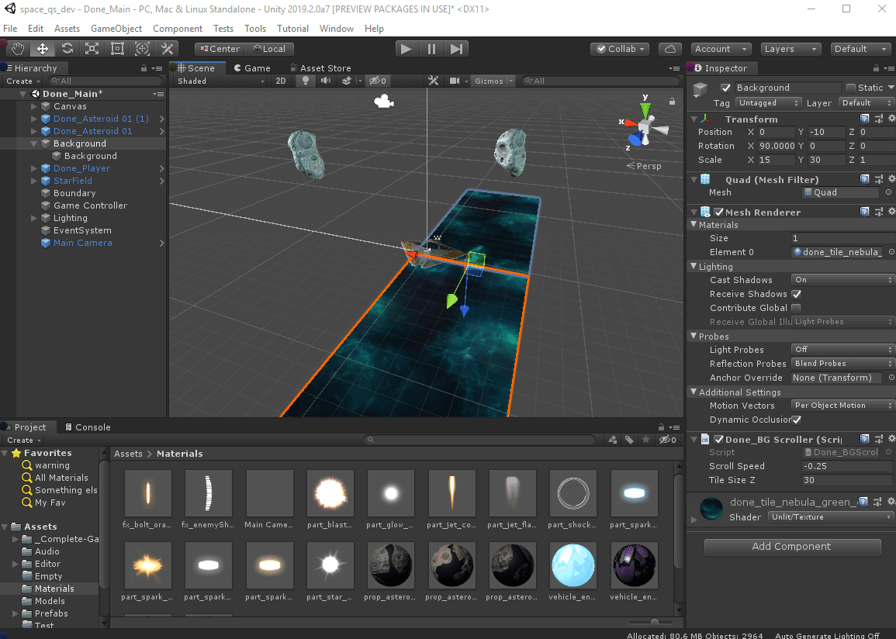

## Drag and Drop

Asset items and Scene Items supports drag and drop from the QuickSearch window to anywhere that supports it (hierarchy view, game view, inspector, etc):

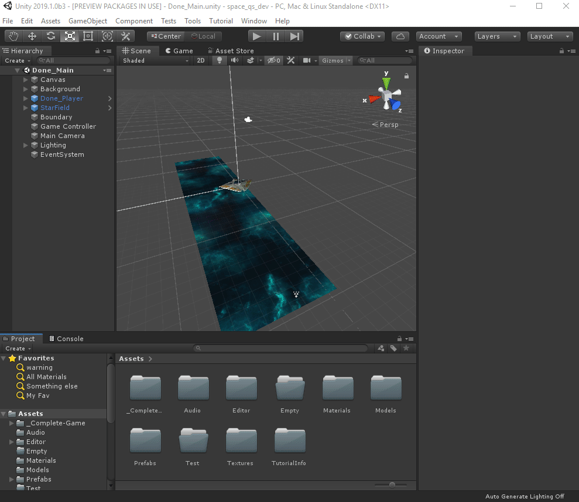

# API

Creating new `SearchProvider` is fairly easy. It basically comes down to providing a function to fetch and search for items and to provide action handlers to `activate` any selected item.

## SearchProvider

An `SearchProvider` manages search for specific type of items and manages thumbnails, description and subfilters. Its basic API is as follow:

```CSharp
public class SearchProvider
{
    public SearchProvider(string id, string displayName = null);

    // Create an Item bound to this provider.
    public SearchItem CreateItem(string id, string label = null, string description = null, Texture2D thumbnail = null);

    // Utility functions use to check if a search text matches a string.
    public static bool MatchSearchGroups(string searchContext, string content);
    public static bool MatchSearchGroups(string searchContext, string content, out int startIndex, out int endIndex);

    public NameId name;

    // Text filter key use to enable this Provider from the NameId search box
    public string filterId;
    // Functor used to fetch item description
    public DescriptionHandler fetchDescription;
    // Functor used to fetch thumbnail icon
    public PreviewHandler fetchThumbnail;
    // Functor used to execute a search query
    public GetItemsHandler fetchItems;
    // Functor use to check if an item is still valid
    public IsItemValidHandler isItemValid;
    // Sub filter specific to this provider
    public List<NameId> subCategories;
}
```

Note that since the UI of the NameId is done using a **virtual scrolling algorithm** some `SearchItem` fields (thumbail and description) are fetched on demand. This means the `SearchProvider` needs to be initialized with specific `Handlers` (fetchDescription, fetchThumbnail) if you want to populate those fields.

### Registering an SearchProvider

Adding a new `SearchProvider` is just creating a function tagged with the `[SearchItemProvider]` attribute. This function must returns a new  `SearchProvider` instance:

```CSharp
[SearchItemProvider]
internal static SearchProvider CreateProvider()
{
    return new SearchProvider(type, displayName)
    {
        filterId = "me:",
        fetchItems = (context, items, provider) =>
        {
            var itemNames = new List<string>();
            var shortcuts = new List<string>();
            GetMenuInfo(itemNames, shortcuts);

            items.AddRange(itemNames.Where(menuName =>
                    SearchProvider.MatchSearchGroups(context.searchText, menuName))
                .Select(menuName => provider.CreateItem(menuName, Path.GetFileName(menuName), menuName)));
        },

        fetchThumbnail = (item, context) => Icons.shortcut
    };
}
```

By default an `SearchProvider` must have a type (ex: asset, menu, scene...) that is unique among providers and a display Name (used in the Provider filter dialog).

Specifying a `filterId` is optional but it makes *text based filtering* easier (ex: `p: my_asset`).

### Performing a search

The bulk of the provider work happens in the `fetchItems` functor. This is  the function a provider creator must fulfill to do an actual search (and filtering). The `fetchItems` signature is:

```CSharp
// context: all the necessary search context (tokenized search, sub filters...)
// items: list of items to populate
// provider: the provider itself
public delegate void GetItemsHandler(SearchContext context, List<SearchItem> items, SearchProvider provider);
```

The `SearchProvider` must add new `SearchItem`s to the `items` list.

An `SearchItem` is a simple struct:

```CSharp
public struct SearchItem
{
    // Unique id of this item among this provider items.
    public string id;
    // Display name of the item
    public string label;
    // If no description is provided, SearchProvider.fetchDescription will be called when the item is first displayed.
    public string description;
    // If no thumbnail are provider, SearchProvider.fetchThumbnail will be called when the item is first displayed.
    public Texture2D thumbnail;
}
```
Only the `id` is necessary to be filled.

When doing filtering according to  `SearchContext.searchText` we recommend using the static function `SearchProvider.MatchSearchGroup` which makes partial search (and eventually fuzzy search) easy (see example above).

### Registering an Action Handler

Actions can be register for a specific provider. These actions buttons will be drawn next to the `SearchItem` of the specified provider type:

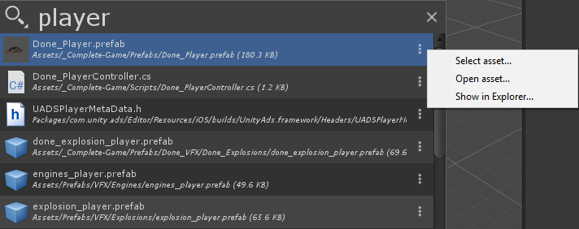

Since registering an action handler is a different process than regisering a provider this means you can register new action handlers for existing providers (mind blown)!

Here is an example of how to register actions for the Asset provider:

```CSharp
[SearchActionsProvider]
internal static IEnumerable<SearchAction> ActionHandlers()
{
    return new[]
    {
        new SearchAction("asset", "select", Icons.@goto, "Select asset...")
        {
            handler = (item, context) =>
            {
                var asset = AssetDatabase.LoadAssetAtPath<Object>(item.id);
                if (asset != null)
                {
                    Selection.activeObject = asset;
                    EditorGUIUtility.PingObject(asset);
                    EditorWindow.FocusWindowIfItsOpen(Utils.GetProjectBrowserWindowType());
                }
            }
        },
        new SearchAction("asset", "open", SearchIcon.open, "Open asset... (Alt+Enter)")
        {
            handler = (item, context) =>
            {
                var asset = AssetDatabase.LoadAssetAtPath<Object>(item.id);
                if (asset != null) AssetDatabase.OpenAsset(asset);
            }
        },
        new SearchAction("asset", "reveal", SearchIcon.folder, "Show in Explorer")
        {
            handler = (item, context) =>
            {
                EditorUtility.RevealInFinder(item.id);
            }
        }
    };
}
```

Basically you create a function tagged with the `[SearchActionsProvider]` attribute. This function must returns an `IEnumerable<SearchAction>`.

An `SearchAction` describe and action and provide a handler to execute the action on a specific `SearchItem`

```CSharp
public class SearchAction
{
    public SearchAction(string providerType, string name, Texture2D icon = null, string tooltip = null);
    public ActionHandler handler;
    public EnabledHandler isEnabled;
}
```

`providerType` is the provider unique id for which you are registering the action.

`ActionHandler` is of the following signature:

```CSharp
// item: item that needs the action to be executed.
// context: search context of the SearchTool when the item is executed.
public delegate void ActionHandler(SearchItem item, SearchContext context);
```

An action can be setup with a `isEnabled` predicate that will decide if the action is available (i.e. enabled) for a specific item.

## SearchService

The `SearchService` manages most of the persisted state of the Quick Search Tool and provider a global end point to access the filter.

The common usage of the `SearchService` for` SearchProvider` writer is to register a shortcut that will open the Quick Search Tool with a specific set of filter enabled:

```CSharp
[Shortcut("Window/Quick Search Tool/Assets", KeyCode.A, ShortcutModifiers.Alt | ShortcutModifiers.Shift)]
public static void PopQuickSearch()
{
    // Disable all filter
    SearchService.Filter.ResetFilter(false);

    // Enabled only the asset SearchProvider
    SearchService.Filter.SetFilter(true, "asset");

    // Disabled the packages sub filter
    SearchService.Filter.SetFilter(false, "asset", "a:packages");

    // Open the Quick Search Tool to allow a quick search of assets!
    SearchTool.ShowWindow();
}
```
